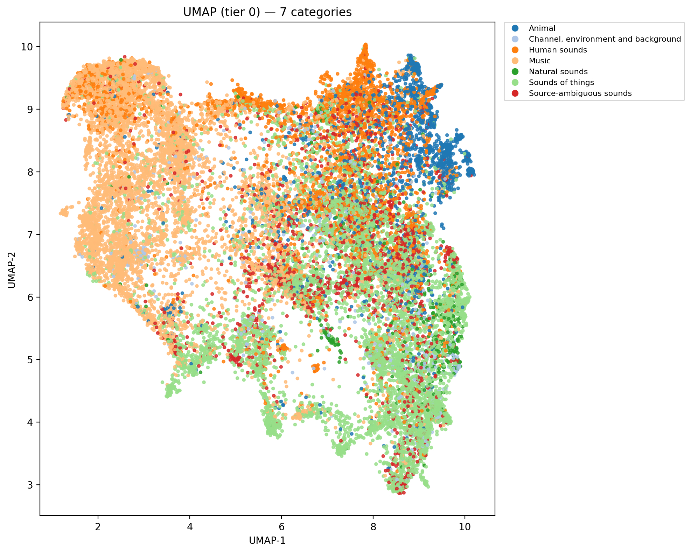

# AudioSet-Classification

[AudioSet](https://research.google.com/audioset/) is a large-scale dataset of sound events: millions of short clips labeled with hundreds of ontology-backed categories, widely used for audio understanding benchmarks.

This project uses it to get hands-on with **CLAP** embeddings—how they cluster, how they behave under a classifier head, and how the full pipeline fits together. The same pattern (precomputed encoder features → task head → optional finetuning) is a template we can reuse for other multimodal encoders later (e.g. **CLIP**-style vision–language models).

The codebase covers data prep and multi-label classification with **HuggingFace CLAP**, PyTorch, and Lightning. Offline feature caches use `ClapFeatureExtractor` (48 kHz); training uses `ClapModel`’s audio encoder as a frozen-then-unfrozen backbone plus a projection head (`BackboneFinetuning` unfreezes the encoder in the last ~10% of epochs).

## Setup

```bash
uv sync
```

`uv sync` pulls **torch**, **torchaudio**, and **torchcodec** (`torchaudio.load` decodes via TorchCodec).

Download the segment CSVs and `class_labels_indices.csv` from the [AudioSet download page](https://research.google.com/audioset/download.html), and add [`ontology.json`](https://raw.githubusercontent.com/audioset/ontology/master/ontology.json) for hierarchy-aware analysis plots. Put them under `dev-data/audioset-csv/` as `balanced_train_segments.csv`, `eval_segments.csv`, `class_labels_indices.csv`, and `ontology.json`.

## Data and training pipeline

Use the same `--clap-model` for `data features` and `train` (default: `laion/clap-htsat-fused`).

1. **Inspect CSVs**

   ```bash
   uv run audioset data inspect
   ```

2. **Download audio** (requires [ffmpeg](https://ffmpeg.org/) on `PATH`, e.g. `brew install ffmpeg`). Downloading the full dataset can take 5+ hours and may require multiple runs due to throttling.

   ```bash
   uv run audioset data download --split train
   uv run audioset data download --split eval
   ```

   Optional: `--max-clips N` for a small run.

3. **Write JSONL manifests** (only clips with existing WAVs are included). Eval rows are shuffled before splitting into `val.jsonl` / `test.jsonl` via `--val-fraction`.

   ```bash
   uv run audioset data manifest
   ```

4. **Precompute CLAP inputs** (one command per split)

   ```bash
   uv run audioset data features --split train --clap-model laion/clap-htsat-fused
   uv run audioset data features --split val --clap-model laion/clap-htsat-fused
   uv run audioset data features --split test --clap-model laion/clap-htsat-fused
   ```

5. **Train**

   ```bash
   uv run audioset train --clap-model laion/clap-htsat-fused --max-epochs 10
   ```

6. **Optional: CLAP embeddings + UMAP** (install analysis deps: `uv sync --group analysis`)

   Embeddings read precomputed `.pt` from step 4 (same `--features-dir` / split as `data features`).

   ```bash
   uv run audioset data embeddings --split train --clap-model laion/clap-htsat-fused
   uv run audioset analysis umap --embeddings dev-data/embeddings/clap/train.npz
   uv run audioset analysis umap --all-splits
   ```

   This writes `dev-data/embeddings/clap/{split}.npz`, caches 2D UMAP coordinates under `dev-data/analysis/umap/`, and saves tier-colored PNGs next to that cache. `--all-splits` loads every available train/val/test npz, fits a single UMAP, and emits one combined figure set. See `audioset analysis umap --help` for paths, naming, and tuning.

Example UMAP showing AudioSet ontology labels clustering together in CLAP space (tier 0, combined splits; same idea as `dev-data/analysis/umap/all_splits_tier_0.png` when you run locally):



Checkpoints and TensorBoard logs go under `training-outputs/` (git-ignored). The first train run may download CLAP weights from the Hugging Face Hub.

## Development

```bash
just format    # ruff check --fix && ruff format
just lint      # ruff check
just typecheck # pyright
just test      # format, lint, typecheck, pytest
```
